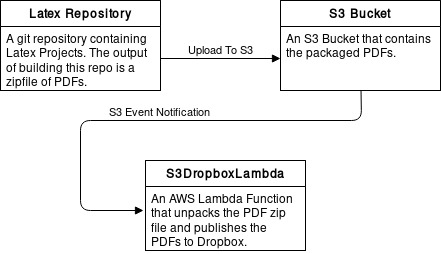

# DossierCloudFormationRuby

The Dossier System is an [AWS CloudFormation][] and [AWS Lambda][] project that publishes [Latex][] documents to
[Dropbox][]. The problem that this system solves is:

1. Neither Latex PDFs or intermediary files are commited to the source repository
2. The projects are built in a reproducable manner
3. The Latex PDFs are published to an easily accessible location

(2) is solved by using [Docker][] and (3) is solved by using AWS Lambda to publish the artifacts from building the Latex
documents to Dropbox.

The system, pictorially, looks like the following pipeline:

<p align="center">
  
</p>

The S3DropboxLambda project is located on GitHub at [S3DropboxLambda][].

[AWS CloudFormation]: https://aws.amazon.com/cloudformation/
[AWS Lambda]: https://aws.amazon.com/lambda/
[Latex]: https://www.latex-project.org/
[Docker]: https://www.docker.com/
[Dropbox]: https://www.dropbox.com/
[S3DropboxLambda]: https://github.com/ErrorsAndGlitches/S3DropboxLambda

# DossierCloudFormationRuby: The CloudFormation Stack

The DossierCloudFormationRuby project deploys the CloudFormation Stack for the Dossier System. This includes the
pipelines for both the Latex documentation and S3DropboxLambda deployment. CloudFormation provides a programatic and
reproducible approach to generating, connecting, and retiring AWS resources.

# Installation

Installation is achieved using `bundle` with the package's `Gemfile`:

```
bundle install
```

# Usage

The CloudFormation project is run using [Rake][] tasks. Use the following to print a list of tasks along with a
description of each task: `rake --tasks`. Different commands require task arguments. The following table provides a
description of each. The `Name` is the name of the argument, which is printed in `rake --tasks`.

| Name                   | Description                                                                                                                     |
|------------------------|---------------------------------------------------------------------------------------------------------------------------------|
| `GitHubConnectionArn`  | The CodeStar GitHub connection ARN. This is used for CodePipeline to connect to the GitHub repo.                                |
| `BuildFailurePhoneNum` | In the event of a build failure, the phone number to send an alert SMS to                                                       |
| `StageNum`             | The CloudFormation stack stage, see [Multi-Stage CloudFormation Stack Deployment](#multi-stage-cloudformation-stack-deployment) |

[Rake]: http://rake.rubyforge.org/

## Multi-Stage CloudFormation Stack Deployment

The CloudFormation stack requires two stages to be deployed. The reason for this because there
is a circular dependency between the trigger S3 bucket and the AWS Lambda function:

* The S3 bucket notification configuration requires the AWS Lambda Function ARN
* The AWS Lambda function requires the S3 bucket's ARN to grant the bucket permission to invoke it

The stages are deployed via (the third argument is the stage number):

```
# run on CLI
rake dossier:deploy_stage'[GITHUB_CONNECTION,PHONE_NUM,0]'
rake dossier:deploy_stage'[GITHUB_CONNECTION,PHONE_NUM,1]'
```

# Project Structure

| Folder   | Description                                                                                            |
|----------|--------------------------------------------------------------------------------------------------------|
| bin      | Contains the `create-dossier-cf-template.rb`, which should not be invoked directly; use the rake tasks |
| lib      | Library files used by the `create-dossier-cf-template.rb` script                                       |
| rakelib  | Library files used by the Rakefile                                                                     |
| sharelib | Library files used as a contract between the Rakefile and the `create-dossier-cf-template.rb` script   |
